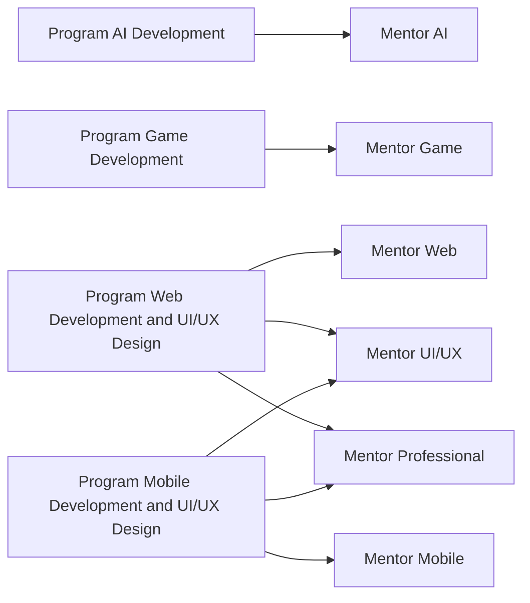
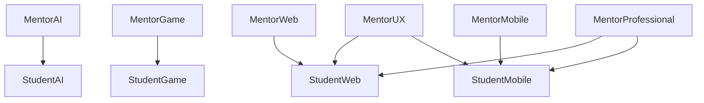
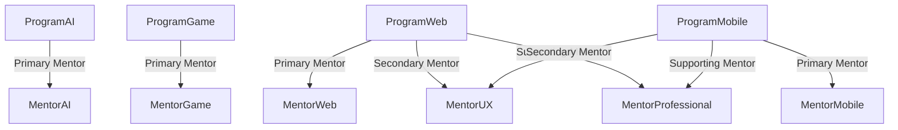
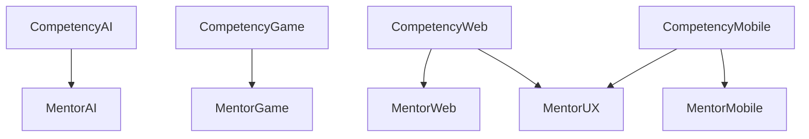
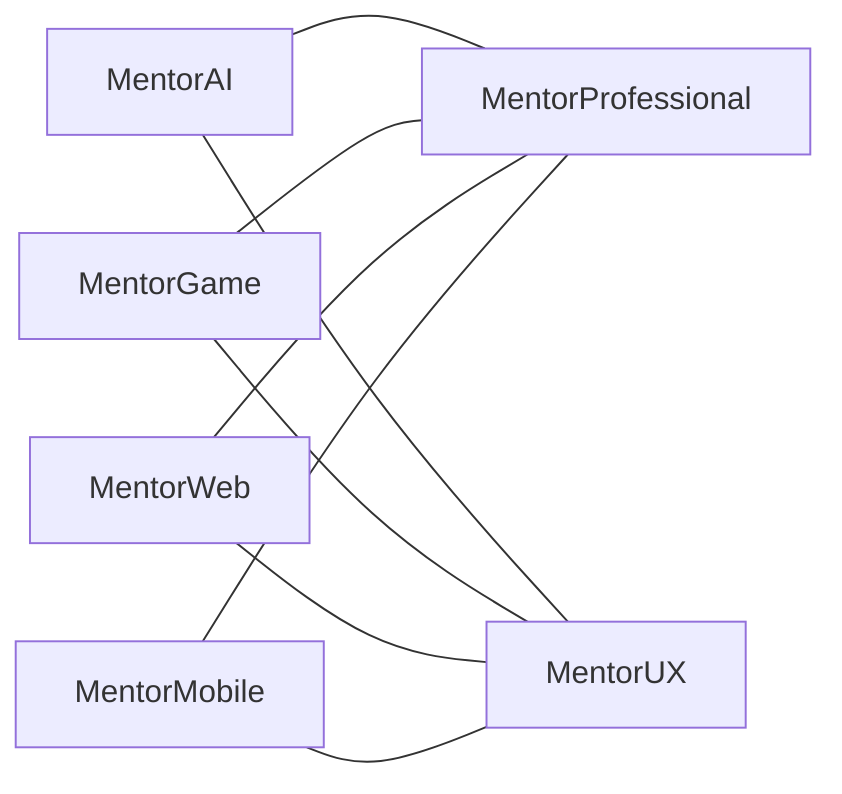
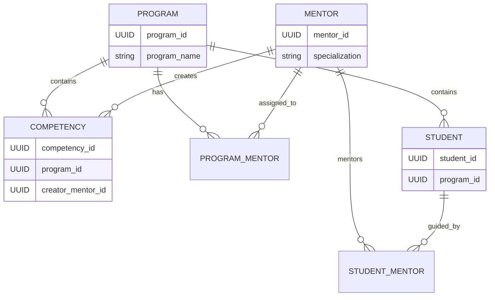

# Infinite Learning LMS v2 Domain Model & Source of Truth

> Version 2.0

> Status: Final Domain Architecture

---

# Bab 1: Pendahuluan dan Tujuan

Dokumen ini merupakan **Source of Truth** utama, mutlak, dan final mengenai seluruh arsitektur domain, spesifikasi entitas, aturan alokasi, logika kepemilikan (ownership), matriks hubungan, serta hierarki perizinan akses di dalam Learning Management System (LMS). Seluruh ketentuan yang tercantum dalam dokumen ini bersifat mengikat untuk seluruh fase siklus pengembangan sistem teknis berikutnya.

Implementasi pada tingkat Backend (arsitektur database, skema tabel, validasi API, permission system, alokasi otomatis, dan role management) serta tingkat Frontend (state management, alur validasi UI, dan perizinan akses komponen) **wajib tunduk dan mematuhi aturan bisnis yang tertera di dalam dokumen ini tanpa pengecualian.** Dokumen ini dirancang dengan tingkat kejelasan dan kompleksitas tinggi untuk mengeliminasi ambiguitas sebelum melangkah ke tahap desain teknis.

---

# Bab 2: Daftar Entitas Domain (Domain Entities)

Sistem LMS ini tersusun atas entitas sistem dasar (Administrator) dan entitas akademik utama (Mentor, Student, Program). Masing-masing entitas didefinisikan secara formal sebagai berikut:

## 1. Entitas Administrator (Admin)

Entitas pengelola sistem tertinggi yang bertanggung jawab atas seluruh operasional manajerial LMS, termasuk eksekusi alokasi murid, pengaturan penugasan mentor, pembuatan program, dan manajemen hak akses pengguna.

## 2. Entitas Mentor

Entitas Mentor diklasifikasikan berdasarkan spesialisasi keahlian teknis dan fungsionalitasnya. Setiap jenis peran mentor di bawah ini dapat diisi oleh lebih dari 1 (satu) orang personel yang bergerak bersama sebagai sebuah tim:

* **Mentor AI**: Mentor dengan spesialisasi penuh pada bidang Artificial Intelligence Development. Bisa berbentuk tim (lebih dari 1 orang).
* **Mentor Web**: Mentor dengan spesialisasi penuh pada bidang Web Development. Bisa berbentuk tim (lebih dari 1 orang).
* **Mentor Mobile**: Mentor dengan spesialisasi penuh pada bidang Mobile Development. Bisa berbentuk tim (lebih dari 1 orang).
* **Mentor Game**: Mentor dengan spesialisasi penuh pada bidang Game Development. Bisa berbentuk tim (lebih dari 1 orang).
* **Mentor UI/UX**: Mentor lintas program dengan spesialisasi pada User Interface dan User Experience Design. Bisa berbentuk tim (lebih dari 1 orang).
* **Mentor Professional**: Mentor lintas program dengan spesialisasi pada pengembangan kemampuan profesional dan Soft Skills. Bisa berbentuk tim (lebih dari 1 orang).

## 3. Entitas Student (Murid)

Entitas Student diklasifikasikan berdasarkan fokus bidang studi yang mereka ambil:

* **Murid AI**: Student yang terdaftar secara aktif pada jalur pembelajaran AI.
* **Murid Web**: Student yang terdaftar secara aktif pada jalur pembelajaran Web.
* **Murid Mobile**: Student yang terdaftar secara aktif pada jalur pembelajaran Mobile.
* **Murid Game**: Student yang terdaftar secara aktif pada jalur pembelajaran Game.

## 4. Entitas Program

Entitas Program merepresentasikan kurikulum terpadu yang disediakan oleh LMS:

* **Program AI Development**
* **Program Game Development**
* **Program Web Development and UI/UX Design**
* **Program Mobile Development and UI/UX Design**

---

# Bab 3: Diagram Hubungan Domain (High Level Domain Diagrams)

Bagian ini mendefinisikan visualisasi hubungan struktural antar entitas akademik dalam bentuk diagram Mermaid.

## 1. High Level Domain Relationship

## 2. Mentor Ownership Diagram

## 3. Program Mentor Assignment

## 4. Competency Ownership

## 5. Mentor Collaboration Diagram

## 6. Conceptual ERD

---

# Bab 4: Spesifikasi Rinci Program & Aturan Hubungan

Bagian ini menjelaskan secara mendalam aturan operasional, logika pembagian murid, batas hak akses, bentuk kolaborasi, dan kepemilikan personal untuk setiap program di LMS.

## 1. Program AI Development

### Mentor Utama (Primary Mentor)

* **Mentor AI** bertindak sebagai mentor utama program AI Development. Entitas ini dapat diisi oleh lebih dari 1 orang personel yang bergerak bersama sebagai satu tim.

### Logika Distribusi Murid (Student Distribution Logic)

* Seluruh **Murid AI** yang terdaftar wajib dibagi rata secara sistematis berdasarkan jumlah personel **Mentor AI** yang tersedia dalam tim saat itu.

### Penulis Kompetensi (Competency Author)

* Seluruh Kompetensi pada Program AI Development wajib dan hanya boleh dibuat oleh **Mentor AI**.

### Kepemilikan Student (Student Ownership)

* **Mentor AI** memiliki murid AI dan hanya murid AI. **Mentor AI** tidak memiliki hak kepemilikan atas murid dari rumpun program lain.

### Mentor Personal (Personal Mentor)

* **Mentor AI** bertindak sebagai mentor personal untuk murid AI saja (*only*).
* **Murid AI** hanya bisa memiliki mentor AI sebagai personal mentor mereka.
* **Murid AI** secara mutlak hanya boleh memiliki tepat 1 (satu) orang personel **Mentor AI** sebagai personal mentor aktif mereka.

### Kerja Sama dan Kolaborasi (Collaboration)

* **Mentor AI** wajib bekerjasama dengan **Mentor Professional** khusus untuk penyediaan materi *Soft Skills (CCA)* sebagai salah satu Kompetensi.
* **Mentor AI** wajib bekerjasama dengan **Mentor UI/UX** khusus untuk penyediaan materi *Capstone Project* sebagai salah satu kompetensi.

---

## 2. Program Game Development

### Mentor Utama (Primary Mentor)

* **Mentor Game** bertindak sebagai mentor utama program Game Development. Entitas ini dapat diisi oleh lebih dari 1 orang personel yang bergerak bersama sebagai satu tim.

### Logika Distribusi Murid (Student Distribution Logic)

* Seluruh **Murid Game** yang terdaftar wajib dibagi rata secara sistematis berdasarkan jumlah personel **Mentor Game** yang tersedia dalam tim saat itu.

### Penulis Kompetensi (Competency Author)

* Seluruh Kompetensi pada Program Game Development wajib dan hanya boleh dibuat oleh **Mentor Game**.

### Kepemilikan Student (Student Ownership)

* **Mentor Game** memiliki murid Game dan hanya murid Game. **Mentor Game** tidak memiliki hak kepemilikan atas murid dari rumpun program lain.

### Mentor Personal (Personal Mentor)

* **Mentor Game** bertindak sebagai mentor personal untuk murid Game saja (*only*).
* **Murid Game** hanya bisa memiliki mentor Game sebagai personal mentor mereka.
* **Murid Game** secara mutlak hanya boleh memiliki tepat 1 (satu) orang personel **Mentor Game** sebagai personal mentor aktif mereka.

### Kerja Sama dan Kolaborasi (Collaboration)

* **Mentor Game** wajib bekerjasama dengan **Mentor Professional** khusus untuk penyediaan materi *Soft Skills (CCA)* sebagai salah satu Kompetensi.
* **Mentor Game** wajib bekerjasama dengan **Mentor UI/UX** khusus untuk penyediaan materi *Capstone Project* sebagai salah satu kompetensi.

---

## 3. Program Web Development and UI/UX Design

### Struktur Hierarki Mentor Program

* **Primary Mentor**: Mentor Web (Mentor Utama)
* **Secondary Mentor**: Mentor UI/UX (Mentor Kedua)
* **Supporting Mentor**: Mentor Professional (Mentor Ketiga)

### Spesifikasi Tim Mentor Web

* Personel yang menyandang peran sebagai **Mentor Web** dapat berjumlah lebih dari 1 orang sebagai sebuah tim akademik, dan diwajibkan melakukan kolaborasi intensif dengan mentor kedua (UI/UX) dan mentor ketiga (Professional).

### Logika Distribusi Murid (Student Distribution Logic)

* Seluruh volume **Murid Web** yang terdaftar pertama-tama harus dibagi rata berdasarkan jumlah personel **Mentor Web** yang tersedia dalam tim utama.
* Apabila terdapat sisa dari hasil pembagian rata tersebut (pembagian tidak habis), maka sisa jumlah murid tersebut wajib dialokasikan dan dibagikan secara merata kepada **Mentor Professional** dan **Mentor UI/UX**.

### Penulis Kompetensi (Competency Author)

* Seluruh Kompetensi pada Program Web Development and UI/UX Design wajib dibuat secara kolaboratif oleh **Mentor Web** dan **Mentor UI/UX**.

### Kepemilikan Student (Student Ownership)

* **Mentor Web** memiliki murid Web dan hanya murid Web.
* **Mentor UI/UX** memiliki fleksibilitas hak kepemilikan untuk dapat memiliki murid Web sekaligus murid Mobile.
* **Mentor Professional** memiliki fleksibilitas hak kepemilikan untuk dapat memiliki murid Web sekaligus murid Mobile.

### Mentor Personal (Personal Mentor)

* Secara fungsional sistem, **Mentor Web**, **Mentor UI/UX**, dan **Mentor Professional** semuanya memiliki kapasitas untuk menjadi mentor personal dari murid Web.
* Aturan pembatasan mutlak (*constraint*): **Murid Web** hanya bisa memiliki salah satu di antara Mentor Web, Mentor Professional, atau Mentor UI/UX sebagai personal mentor mereka.
* Jumlah personal mentor untuk **Murid Web** dibatasi secara ketat, di mana mereka hanya bisa memiliki tepat 1 (satu) personal mentor aktif dari pilihan kategori tersebut.

### Kerja Sama dan Kolaborasi (Collaboration)

* **Mentor Web** wajib bekerjasama dengan **Mentor Professional** untuk penyediaan materi *Soft Skills (CCA)* sebagai salah satu Kompetensi.
* **Mentor Web** wajib bekerjasama dengan **Mentor UI/UX** untuk penyediaan materi *UI/UX Design* serta materi *Capstone Project* sebagai bagian dari Kompetensi program.

---

## 4. Program Mobile Development and UI/UX Design

### Struktur Hierarki Mentor Program

* **Primary Mentor**: Mentor Mobile (Mentor Utama)
* **Secondary Mentor**: Mentor UI/UX (Mentor Kedua)
* **Supporting Mentor**: Mentor Professional (Mentor Ketiga)

### Spesifikasi Tim Mentor Mobile

* Personel yang menyandang peran sebagai **Mentor Mobile** dapat berjumlah lebih dari 1 orang sebagai sebuah tim akademik, dan diwajibkan melakukan kolaborasi intensif dengan mentor kedua (UI/UX) dan mentor ketiga (Professional).

### Logika Distribusi Murid (Student Distribution Logic)

* Seluruh volume **Murid Mobile** yang terdaftar pertama-tama harus dibagi rata berdasarkan jumlah personel **Mentor Mobile** yang tersedia dalam tim utama.
* Apabila terdapat sisa dari hasil pembagian rata tersebut (pembagian tidak habis), maka sisa jumlah murid tersebut wajib dialokasikan dan dibagikan secara merata kepada **Mentor Professional** dan **Mentor UI/UX**.

### Penulis Kompetensi (Competency Author)

* Seluruh Kompetensi pada Program Mobile Development and UI/UX Design wajib dibuat secara kolaboratif oleh **Mentor Mobile** dan **Mentor UI/UX**.

### Kepemilikan Student (Student Ownership)

* **Mentor Mobile** memiliki murid Mobile dan hanya murid Mobile.
* **Mentor UI/UX** memiliki fleksibilitas hak kepemilikan untuk dapat memiliki murid Web sekaligus murid Mobile.
* **Mentor Professional** memiliki fleksibilitas hak kepemilikan untuk dapat memiliki murid Web sekaligus murid Mobile.

### Mentor Personal (Personal Mentor)

* Secara fungsional sistem, **Mentor Mobile**, **Mentor UI/UX**, dan **Mentor Professional** semuanya memiliki kapasitas untuk menjadi mentor personal dari murid Mobile.
* Aturan pembatasan mutlak (*constraint*): **Murid Mobile** hanya bisa memiliki salah satu di antara Mentor Mobile, Mentor Professional, atau Mentor UI/UX sebagai personal mentor mereka.
* Jumlah personal mentor untuk **Murid Mobile** dibatasi secara ketat, di mana mereka hanya bisa memiliki tepat 1 (satu) personal mentor aktif dari pilihan kategori tersebut.

### Kerja Sama dan Kolaborasi (Collaboration)

* **Mentor Mobile** wajib bekerjasama dengan **Mentor Professional** untuk penyediaan materi *Soft Skills (CCA)* sebagai salah satu Kompetensi.
* **Mentor Mobile** wajib bekerjasama dengan **Mentor UI/UX** untuk penyediaan materi *UI/UX Design* serta materi *Capstone Project* sebagai bagian dari Kompetensi program.

---

# Bab 5: Matriks Kepemilikan (Ownership Matrix)

| Nama Program | Primary Mentor (Team) | Secondary Mentor | Supporting Mentor | Aturan Alokasi Volume Murid | Pembuat Kompetensi (Author) | Aturan Personal Mentor |
| --- | --- | --- | --- | --- | --- | --- |
| **AI Development** | Mentor AI (Bisa > 1 orang) | Mentor UI/UX (Batas: Capstone) | Mentor Professional (Batas: CCA) | Dibagi rata per jumlah Mentor AI yang tersedia | Mentor AI | Tepat 1 orang Mentor AI |
| **Game Development** | Mentor Game (Bisa > 1 orang) | Mentor UI/UX (Batas: Capstone) | Mentor Professional (Batas: CCA) | Dibagi rata per jumlah Mentor Game yang tersedia | Mentor Game | Tepat 1 orang Mentor Game |
| **Web Development and UI/UX Design** | Mentor Web (Bisa > 1 orang) | Mentor UI/UX | Mentor Professional | Dibagi rata ke Mentor Web, sisa pembagian diberikan ke Professional dan UI/UX | Mentor Web + Mentor UI/UX | Tepat 1 pilihan antara Web / Professional / UI/UX |
| **Mobile Development and UI/UX Design** | Mentor Mobile (Bisa > 1 orang) | Mentor UI/UX | Mentor Professional | Dibagi rata ke Mentor Mobile, sisa pembagian diberikan ke Professional dan UI/UX | Mentor Mobile + Mentor UI/UX | Tepat 1 pilihan antara Mobile / Professional / UI/UX |

---

# Bab 6: Aturan Bisnis Mutlak (Business Rules Constraints)

Setiap poin di bawah ini merupakan aturan validasi logika (*hard constraints*) yang wajib ditanamkan pada sistem tanpa toleransi pengecualian:

* **Rule 1**: Murid AI secara eksklusif hanya diperbolehkan terhubung dengan personel dari entitas Mentor AI dalam skema bimbingan personal mentor.
* **Rule 2**: Murid Game secara eksklusif hanya diperbolehkan terhubung dengan personel dari entitas Mentor Game dalam skema bimbingan personal mentor.
* **Rule 3**: Setiap satu individu Murid Web dikunci oleh aturan sistem untuk hanya bisa memilih dan memiliki tepat 1 (satu) orang personal mentor aktif, yang dipilih dari salah satu kategori: Mentor Web, Mentor Professional, atau Mentor UI/UX. Sistem wajib menolak apabila murid memiliki lebih dari satu mentor personal atau tidak memiliki sama sekali.
* **Rule 4**: Setiap satu individu Murid Mobile dikunci oleh aturan sistem untuk hanya bisa memilih dan memiliki tepat 1 (satu) orang personal mentor aktif, yang dipilih dari salah satu kategori: Mentor Mobile, Mentor Professional, atau Mentor UI/UX. Sistem wajib menolak apabila murid memiliki lebih dari satu mentor personal atau tidak memiliki sama sekali.
* **Rule 5**: Otoritas pembuatan dan modifikasi Kompetensi pada Program AI Development secara mutlak berada di bawah kendali eksklusif Mentor AI.
* **Rule 6**: Otoritas pembuatan dan modifikasi Kompetensi pada Program Game Development secara mutlak berada di bawah kendali eksklusif Mentor Game.
* **Rule 7**: Otoritas pembuatan dan modifikasi Kompetensi pada Program Web Development and UI/UX Design dipegang bersama dan hanya diperbolehkan bagi entitas Mentor Web dan Mentor UI/UX.
* **Rule 8**: Otoritas pembuatan dan modifikasi Kompetensi pada Program Mobile Development and UI/UX Design dipegang bersama dan hanya diperbolehkan bagi entitas Mentor Mobile dan Mentor UI/UX.
* **Rule 9**: Hak kepemilikan dan pengelolaan modul instruksional Soft Skills (CCA) sebagai bagian kompetensi program secara mutlak hanya boleh dimiliki dan dikelola oleh Mentor Professional.
* **Rule 10**: Hak kepemilikan dan pengelolaan modul instruksional Capstone Project sebagai bagian kompetensi program secara mutlak hanya boleh dimiliki dan dikelola oleh Mentor UI/UX.
* **Rule 11**: Hak kepemilikan dan pengelolaan materi kurikulum UI/UX Design secara mutlak berada di bawah otoritas penuh Mentor UI/UX (berlaku khusus pada rumpun Program Web dan Program Mobile).
* **Rule 12**: Setiap individu Student hanya boleh terdaftar pada 1 (satu) Program aktif dalam satu satuan waktu tunggal.
* **Rule 13**: Fungsi Primary Mentor memegang peranan tertinggi atas koordinasi struktur akademik makro dari masing-masing program yang dipimpinnya.
* **Rule 14**: Fungsi Secondary Mentor dibatasi secara ketat hanya memiliki hak akses operasional dan tanggung jawab penuh pada pemenuhan aspek kompetensi spesialisasi desain antarmuka dan pengalaman pengguna (UI/UX).
* **Rule 15**: Fungsi Supporting Mentor bertindak sebagai penyedia intervensi kompetensi pendukung (Soft Skills/CCA) lintas program tanpa memiliki hak kepemilikan struktural atas program tersebut.
* **Rule 16**: Logika otomatisasi alokasi pada Backend wajib menerapkan fungsi pembagian rata (pembagian integer tanpa sisa) untuk distribusi murid ke tim utama, dan mengalihkan sisa nilai pembagian (*remainder*) ke tabel penugasan mentor pendukung (UI/UX dan Professional) khusus untuk rumpun Program Web dan Mobile.
* **Rule 17 (Administrator Authority)**: Konfigurasi peran otoritas (*System Roles*) dibatasi pada tiga hierarki utama: **Student**, **Mentor**, dan **Admin**. Seluruh eksekusi, inisiasi, dan konfigurasi dari hubungan manajerial yang dibahas dalam dokumen ini (termasuk pembagian murid ke mentor, penugasan posisi mentor pada program, dan penyetujuan role) adalah wewenang mutlak yang hanya bisa dieksekusi oleh seorang **Admin**.
* **Rule 18 (Role Overlap & Escalation)**: Entitas pengguna dengan jabatan **Admin** diperbolehkan oleh sistem untuk merangkap posisi fungsional sebagai **Mentor** (bertindak ganda sebagai pengelola sistem dan pembimbing akademik). Sebaliknya, seorang **Mentor** tidak memiliki akses otorisasi sebagai **Admin** secara bawaan (*default*). Seorang Mentor hanya dapat diangkat untuk merangkap jabatan sebagai Admin apabila pengajuan tersebut telah disetujui (*approved*) secara eksplisit oleh entitas yang sudah menjabat sebagai Admin sebelumnya.

---

# Bab 7: Catatan Implementasi Sistem Teknis

Dokumen Source of Truth ini menjadi rujukan legal tunggal yang melandasi pengerjaan teknis:

1. **Perancangan Skema Database**: Implementasi *Logical and Physical Database Schema*, pengaturan *Table Constraints*, *Foreign Key*, dan *Integrity Check* untuk memastikan tidak ada relasi silang di luar aturan yang diizinkan.
2. **Spesifikasi Kontrak API**: Pembangunan endpoint yang aman dan terstruktur (seperti *Payload Request* alokasi murid dan validasi pembatasan 1 *Personal Mentor* per murid).
3. **Desain Role-Based Access Control (RBAC) 3 Lapis**: Sistem wajib mendukung arsitektur multi-role yang fleksibel, memetakan tiga entitas akses utama: `ROLE_STUDENT`, `ROLE_MENTOR`, dan `ROLE_ADMIN`. Sistem pengguna (User Table) harus memungkinkan penyimpanan list relasi *many-to-many* untuk otorisasi akses (misal: satu *user_id* memiliki array role `['ADMIN', 'MENTOR']`).
4. **Implementasi Workflow Approval**: Pembangunan antarmuka (*Interface*) dan *Endpoint* khusus bagi Admin aktif untuk melakukan penyetujuan (*Approval Workflow*) terhadap permohonan eskalasi hak akses seorang Mentor yang ingin merangkap menjadi Admin.
5. **Keamanan Data dan Proteksi Lintas Modul**: Desain sistem perizinan yang memblokir keras upaya *Mentor* mengakses modul administratif (*Admin Dashboard*) jika tidak merangkap peran Admin, serta membatasi Mentor dari melihat data program yang tidak menjadi wilayah kekuasaannya.
6. **Implementasi Validasi Aturan Bisnis Otomatis**: Logika backend terpusat yang menjalankan fungsi distribusi *round-robin* atau pembagian rata (modulo) untuk murid, mendistribusikan sisa (*remainder*) dengan akurat, dan menolak form jika menyalahi kepemilikan personal.